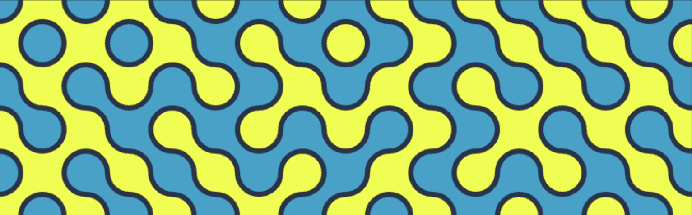

# Truchet



Truchet documents a method for statically coloring Truchet tiles. The output of this project is the [writeup](https://chris-braun.github.io/truchet/). Please read the writeup for the backstory on `truchet.ts` if you're interested. Then read `truchet.ts` because that's where the magic happens.

The other file of slight interest is `main.ts` which is a little bit of code to glue `index.html` and `truchet.ts` together. There are also files for Vite and GitHub which can all be safely ignored unless you are interested in those details.

## Installation

There's nothing to install unless you want to play with the code. In that case, clone the repository:

```sh
git clone https://github.com/chris-braun/truchet.git
```

And install its dependencies:

```sh
cd truchet
npm install
```

## Usage

This is a vanilla-ts [Vite](https://vite.dev/guide/) project. Running Truchet launches the writeup web page locally.

```sh
npm run dev
```
